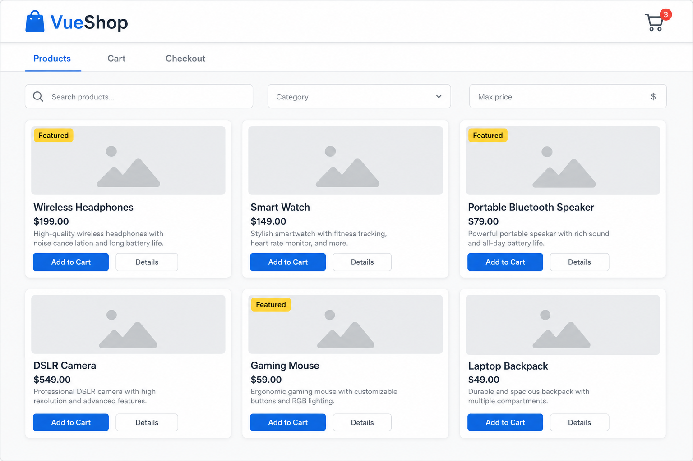
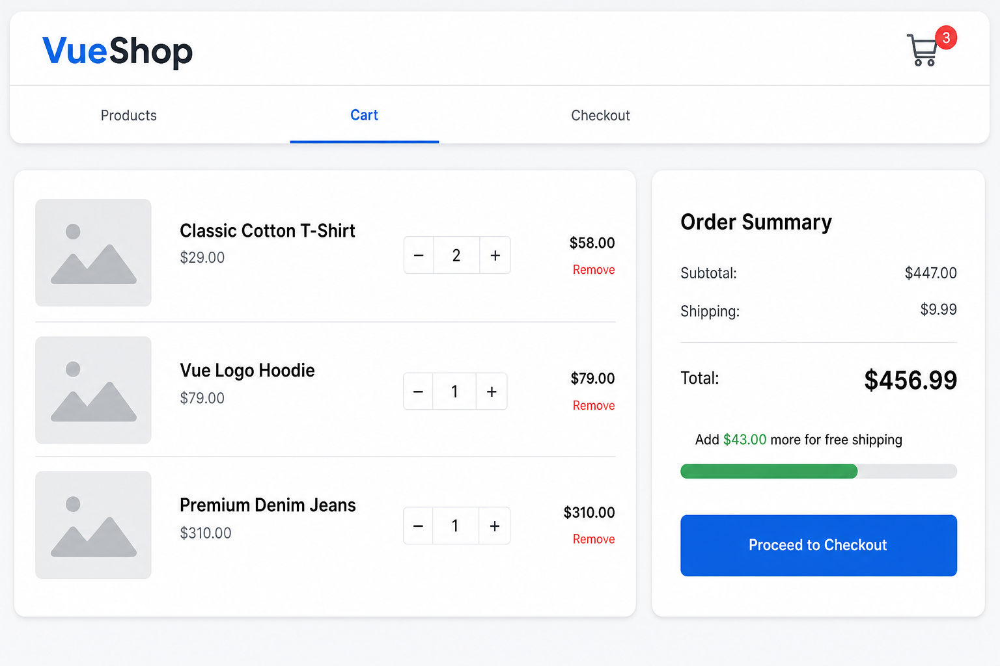
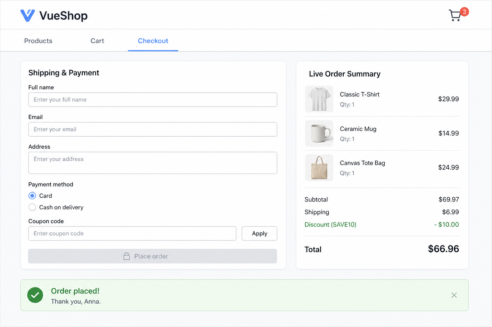

## User story

> **As a** shopper visiting VueShop,
> **I want** to browse products, filter them, add them to a cart, adjust quantities, and check out with a validated form,
> **so that** I can place an order and see a clear, live summary of what I am buying and how much it costs.

---

## Description

You will build a small store with **three views** switched by tabs in a single page:

1. **Products** - a searchable, filterable catalog of product cards.
2. **Cart** - the items the user added, with quantity steppers and an order summary.
3. **Checkout** - a shipping/payment form with validation, a coupon field, and a live order summary.

The product data is **mocked** (a local array). On first load you must **simulate fetching** it (a short delay with a loading state) so the lifecycle and async-ish flow is realistic. The cart state must be **shared** between views and **persisted** so a page refresh keeps the cart.

The app must be split into small components that talk to each other through **props and events**, and reusable logic must live in **composables**.

---

## Mockups

The UI does not have to be pixel-perfect, but it should match the structure and behavior shown below.

### 1. Products view



### 2. Cart view



### 3. Checkout view



---

## Suggested component structure

You are free to adjust names, but aim for something like this:

```
homework/
└── src/
    ├── App.vue                  # shell: header + tab navigation + <component :is>
    ├── composables/
    │   ├── useProducts.js       # loads & exposes products (+ loading state)
    │   ├── useCart.js           # shared cart state, totals, add/remove/update
    │   └── useLocalStorage.js   # generic reactive localStorage helper
    ├── views/
    │   ├── ProductsView.vue
    │   ├── CartView.vue
    │   └── CheckoutView.vue
    └── components/
        ├── AppHeader.vue        # logo + cart icon with item-count badge
        ├── ProductCard.vue      # props in, emits "add-to-cart"; uses slots
        ├── CartItem.vue         # props in, emits "update-qty" / "remove"
        ├── OrderSummary.vue     # reusable summary (used in Cart and Checkout)
        └── BaseModal.vue        # reusable modal using slots (product details)
```

---

## Acceptance criteria

Each criterion is tagged with the lesson it covers: `[#1]`...`[#16]`.
Aim to satisfy **all** of them; partial coverage is fine but the more, the better.

### A. App shell & navigation

- [ ] The app uses Single File Components and `<script setup>` everywhere. `[#1]`
- [ ] `App.vue` renders an `AppHeader` component and the active view as separate components. `[#2]`
- [ ] The three views (`Products`, `Cart`, `Checkout`) are switched using `<component :is>`. `[#15]`
- [ ] The currently active tab is visually highlighted (e.g. a modifier class). `[#4]`
- [ ] Switching to **Cart** and back to **Products** must **not** reset the products view's local UI state (search text, filters). Use `<KeepAlive>`. `[#15]`
- [ ] `AppHeader` shows a cart icon with a badge displaying the **total number of items** in the cart; the badge is hidden when the cart is empty. `[#3]` `[#4]`

### B. Products view

- [ ] On first mount, products are **not** shown immediately: a "Loading products..." message appears, then after a simulated delay (e.g. `setTimeout` ~800 ms) the products render. `[#10]`
- [ ] Products are loaded and exposed through a `useProducts` composable, not hard-coded inside the view. `[#16]`
- [ ] The catalog renders a grid of `ProductCard` components from the products list. `[#4]` `[#11]`
- [ ] Each `ProductCard` receives its product via **props** (typed, `required`) and renders name, price, and description. `[#11]`
- [ ] Price is always formatted to 2 decimals with a currency symbol (e.g. `$199.00`) via a method or computed. `[#3]` `[#6]`
- [ ] A "Featured" badge is shown **only** for products flagged as featured. `[#4]`
- [ ] `ProductCard` exposes a **named slot** for actions and a **default slot** for the description (with fallback text "No description"). `[#13]`
- [ ] `ProductCard` emits an `add-to-cart` event with its product; the view/composable handles it. `[#11]` `[#8]`
- [ ] A **search input** (bound with `v-model`) filters products by name (case-insensitive). `[#12]` `[#6]`
- [ ] A **category** `<select>` (`v-model`) and a **max-price** number input (`v-model`) further filter the list. `[#12]` `[#6]`
- [ ] The filtered list is a `computed` derived from the raw list + filters (do not mutate the source array). `[#6]`
- [ ] If no product matches the filters, show an empty state message instead of an empty grid. `[#4]`
- [ ] Clicking "Details" opens a `BaseModal` whose content is provided via slots, showing the product's full details. `[#13]`

### C. Cart view & shared cart

- [ ] Cart state lives in a `useCart` composable and is **shared** between the header, products, cart, and checkout (same state, not copies). `[#16]` `[#5]`
- [ ] Adding the same product twice increases its quantity instead of duplicating the row. `[#9]`
- [ ] Each cart row is a `CartItem` component that receives the item via props and emits `update-qty` and `remove`. `[#11]`
- [ ] A quantity stepper (− / number / +) updates the quantity; quantity can never go below 1. `[#8]` `[#9]`
- [ ] "Remove" deletes the row from the cart (array mutation handled in the composable). `[#9]`
- [ ] An `OrderSummary` component shows **subtotal**, **shipping**, and **total**, all derived with `computed`. `[#6]`
- [ ] Shipping is `$9.99`, but becomes **free** when the subtotal is `>= $200`. The total updates reactively. `[#6]` `[#4]`
- [ ] A `watch` observes the subtotal and updates a "Add $X more for free shipping" message (hidden once free shipping is reached). `[#7]`
- [ ] The cart is persisted to `localStorage` (via a `useLocalStorage` composable) and restored on reload. `[#16]` `[#7]`
- [ ] When the cart is empty, the Cart view shows an empty state and hides the summary. `[#4]`

### D. Checkout view

- [ ] A form collects **full name**, **email**, and **address** using `v-model`. `[#12]`
- [ ] Payment method is chosen with **radio buttons** bound by `v-model` (`Card` / `Cash on delivery`). `[#12]`
- [ ] A **coupon code** input with an "Apply" button: entering `SAVE10` (case-insensitive) applies a `$10` discount shown as a separate summary line. `[#8]` `[#6]`
- [ ] The same `OrderSummary` component is reused here and now also shows the discount line when a coupon is applied. `[#2]` `[#13]`
- [ ] "Place order" is **disabled** until full name and email are non-empty and email contains `@`. Use a `computed` for validity. `[#6]` `[#4]`
- [ ] When the checkout view mounts, the **full name** input is **auto-focused** using a template ref. `[#14]`
- [ ] Clicking "Apply" without a coupon, or with an invalid one, focuses the coupon input again (template ref). `[#14]`
- [ ] On "Place order", show a green confirmation banner: `Order placed! Thank you, {name}.`, then **clear the cart**. `[#8]` `[#9]`

### E. Code quality

- [ ] Boolean variables use `is/has/should` naming (e.g. `isLoading`, `hasItems`, `isCheckoutValid`).
- [ ] All functions are arrow functions; names are descriptive.
- [ ] CSS class names follow **BEM** (`block`, `block__element`, `block--modifier`).
- [ ] No `console` noise left in the final version (lifecycle logs are fine while developing).

---

## Usage examples (scenarios)

**Scenario 1 - Filtering**

```
Given the catalog has loaded
When I type "watch" in the search box
Then only products whose name contains "watch" (any case) remain visible
And if I also set Max price = 100, the "Smart Watch ($149)" disappears
```

**Scenario 2 - Adding to cart updates the badge**

```
Given the cart is empty (no badge shown)
When I click "Add to Cart" on "Wireless Headphones" twice
Then the header badge shows "2"
And the Cart view shows one row "Wireless Headphones" with quantity 2 and line total $398.00
```

**Scenario 3 - Free shipping threshold**

```
Given my subtotal is $180.00
Then the summary shows "Add $20.00 more for free shipping" and Shipping = $9.99
When I raise the quantity so the subtotal becomes $210.00
Then Shipping becomes "Free", the message disappears, and the Total drops accordingly
```

**Scenario 4 - Coupon**

```
Given my subtotal is $69.97 and shipping is $6.99
When I enter "save10" and click Apply
Then a line "Discount (SAVE10): -$10.00" appears
And the Total becomes $66.96
```

**Scenario 5 - Checkout validation & confirmation**

```
Given I am on Checkout and the Full name field is auto-focused
When the email field is empty or has no "@"
Then "Place order" stays disabled
When I fill "Anna" and "anna@example.com"
Then "Place order" becomes enabled
When I click it
Then I see "Order placed! Thank you, Anna." and the cart becomes empty
```

**Scenario 6 - Persistence**

```
Given I have 3 items in my cart
When I refresh the page
Then the cart still contains the same 3 items (restored from localStorage)
```
